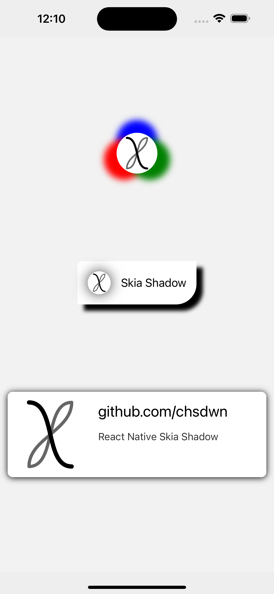
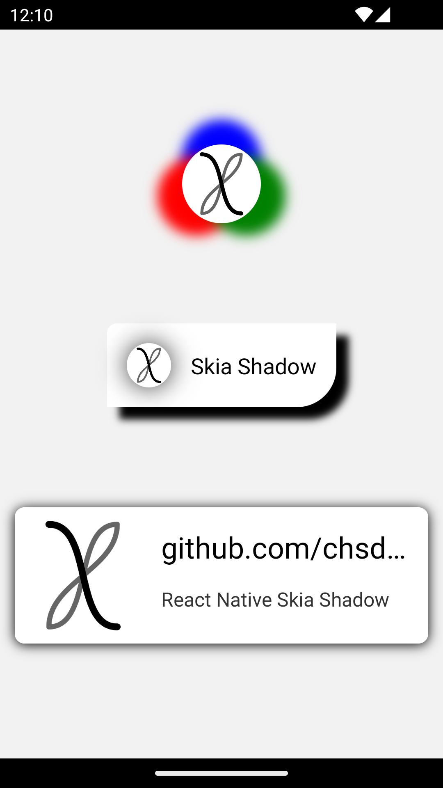

<div align="center">
  <a name="title"></a>
  <h3 align="center">React Native Skia Shadow</h3>
  
  <p align="center">
    Android and iOS compatible shadows with React Native Skia.
    <br />
    <br />
    <a href="https://github.com/chsdwn/react-native-skia-shadow/issues">Report Bug</a>
    ·
    <a href="https://github.com/chsdwn/react-native-skia-shadow/issues">Request Feature</a>
  </p>
</div>

<details>
  <summary>Table of Contents</summary>
  <ol>
    <li><a href="#about-the-project">About The Project</a></li>
    <li>
      <a href="#getting-started">Getting Started</a>
      <ul>
        <li><a href="#peer-dependencies">Peer Dependencies</a></li>
        <li><a href="#installation">Installation</a></li>
      </ul>
    </li>
    <li><a href="#usage">Usage</a></li>
    <li><a href="#contributing">Contributing</a></li>
    <li><a href="#license">License</a></li>
    <li><a href="#acknowledgments">Acknowledgments</a></li>
  </ol>
</details>

## About the Project

<p align="center">Take a look at the iOS and Android screenshots below.</p>

<div style="display: flex; justify-content: space-evenly; flex-wrap: wrap;">

<div>

### iOS (iPhone 15 Pro Max)



</div>

<div>

### Android (Nexus 5)



</div>

</div>

## Getting Started

### Peer Dependencies

#### `@shopify/react-native-skia`

##### React Native CLI

```sh
npm install @shopify/react-native-skia
```

```sh
yarn add @shopify/react-native-skia
```

- (MacOS only) Install Cocoa packages

  ```sh
  npx pod-install
  ```

##### Expo

```sh
npx expo install @shopify/react-native-skia
```

### Installation

```sh
npm install react-native-skia-shadow
```

```sh
yarn add react-native-skia-shadow
```

<p align="right">(<a href="#title">back to top</a>)</p>

## Usage

Wrap the component you want to add a shadow inside a `SkiaShadow` component.

### Props

| Prop                    | Type     |        Default |
| ----------------------- | -------- | -------------: |
| blur                    | `number` |                |
| dx                      | `number` |                |
| dy                      | `number` |                |
| color                   | `Color`  |      `'black'` |
| borderRadius            | `number` |            `0` |
| borderTopLeftRadius     | `number` | `borderRadius` |
| borderTopRightRadius    | `number` | `borderRadius` |
| borderBottomLeftRadius  | `number` | `borderRadius` |
| borderBottomRightRadius | `number` | `borderRadius` |

### Example

```tsx
import React from 'react';
import { StyleSheet, View } from 'react-native';
import { SkiaShadow } from 'react-native-skia-shadow';

export const App = () => {
  return (
    <View style={styles.container}>
      <SkiaShadow blur={5} dx={0} dy={0} color="blue" borderRadius={9999}>
        <View style={styles.circle} />
      </SkiaShadow>
    </View>
  );
};

const styles = StyleSheet.create({
  container: {
    flex: 1,
    justifyContent: 'center',
    alignItems: 'center',
  },
  circle: {
    width: 150,
    height: 150,
    borderRadius: 9999,
    backgroundColor: 'red',
  },
});
```

For usage details, please refer to the `src` folder of the example app. https://github.com/chsdwn/react-native-skia-shadow/tree/main/example/src

<p align="right">(<a href="#title">back to top</a>)</p>

## Contributing

See the [contributing guide](https://github.com/chsdwn/react-native-skia-shadow/blob/main/CONTRIBUTING.md) to learn how to contribute to the repository and the development workflow.

<p align="right">(<a href="#title">back to top</a>)</p>

## License

Distributed under the MIT License. See [`LICENSE`](https://github.com/chsdwn/react-native-skia-shadow/blob/main/LICENSE) for more information.

<p align="right">(<a href="#title">back to top</a>)</p>

## Acknowledgments

- Made with [create-react-native-library](https://github.com/callstack/react-native-builder-bob)
- [React Native Skia](https://github.com/Shopify/react-native-skia)

<p align="right">(<a href="#title">back to top</a>)</p>
